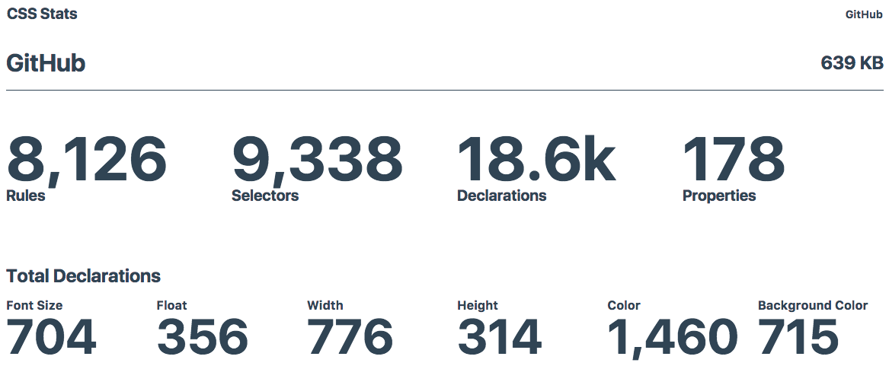
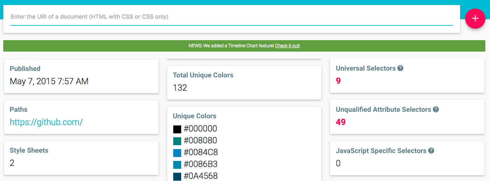
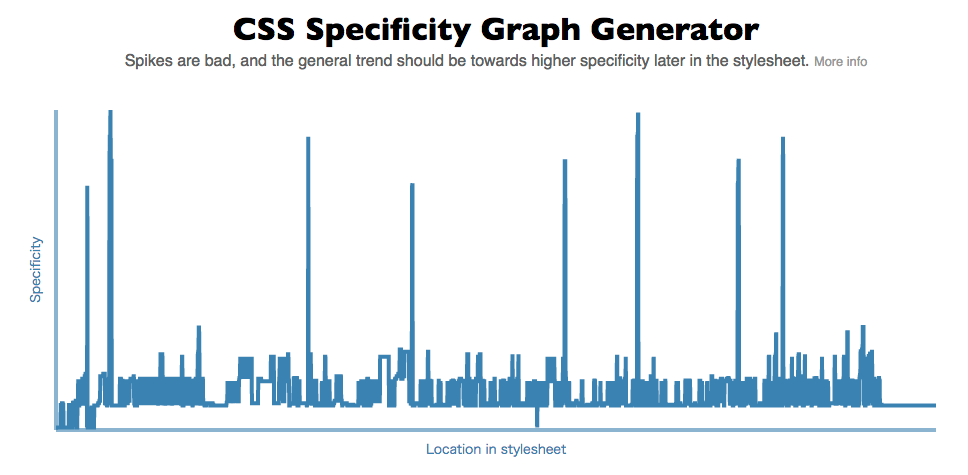
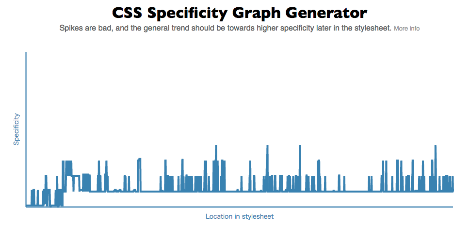
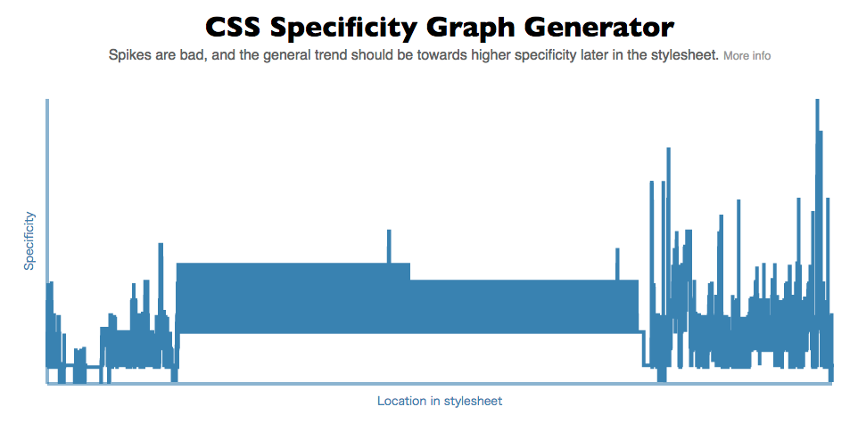

# CSS設計を破綻させない

builderscon tokyo 2016 [@kubosho_](https://twitter.com/kubosho_)
---
では、CSS設計を破綻させないというテーマで話します。よろしくお願いします。

-----
## 自己紹介

- kubosho_
- フロントエンドデベロッパー
- [Goodpatch](http://goodpatch.com/jp)所属
- [https://github.com/kubosho](https://github.com/kubosho/)
- [https://twitter.com/kubosho_](https://twitter.com/kubosho_)
- [http://blog.kubosho.com](http://blog.kubosho.com/)
---
自己紹介です。

-----
## 話すこと

- CSSの設計はどのようにしたらいいのか
- CSSの設計が破綻していないかツールを使って検知する

-----
## CSSを破綻させたことありますか？

---

ここで挙手を求める

-----

## CSSは破綻しやすい

OOCSSの提唱者Nicole Sulliban氏も["CSS is too fragile"](http://www.andoh.org/2009/11/web-directions-east-2009-nicole.html)と言った

-----

## 意識して書かないと容易に破綻する

-----
<!--code-->
## CSSの破綻

定義の重複が複数ある

```css
.button {
  border: 1px solid #ccc;
}

/* ...長いコードの後や別ファイルなど... */

.button {
  border: 1px solid #666;
}
```

-----
<!--code-->
## CSSの破綻

前に書いたセレクタの詳細度が高い

```css
 /* 詳細度はa=0, b=4, c=0なので0.4.0となる */
.container .form .form-group .form-submit-button {}

/*
  詳細度はa=0, b=1, c=0なので0.1.0となる
  上書きできない。つらい
*/
.form__submit-button {}
```

-----
<!--code-->
## CSSの破綻

命名規則がバラバラ

```css
.account-login-button {}

.commentSubmitButton {}

.form_submit_button {}
```

-----
<!--code-->
## CSSの破綻

同じ見た目になるのか分からない

```html
<a class="button button-submit">送信</a>
<button type="button" class="button button-submit">送信</button>
```

-----
## CSSの破綻

- 詳細度が管理されていない
- ルールセットの分割粒度が明確ではない
- 命名規則が決まっていない
- 同じ見た目になるのか分からない

-----
## 詳細度を管理する

- Sassなどのプリプロセッサを使う場合はファイル内で下に行くにつれて詳細度が高くなるようにする
- セレクタやIDセレクタを書きすぎないようにする

-----
<!--code-->
## 詳細度を管理する

```css
.container #contents .form .form-button {
  margin: 0;
}

/* ... */

.comment-form .form-button {
  /* 上書きできない＼(^o^)／ */
  margin: 10px auto;
}
```

---
ページの基礎のスタイルを定義するCSSファイルで以下のようなセレクタを書いてしまうと、あとから大変

-----
<!--code-->

## 詳細度を管理する

```css
.form .form-button {
  margin: 0;
}

/* ... */

.comment-form .form-button {
  /* 上書きできる */
  margin: 10px auto;
}
```

-----
## ルールセットの分割粒度を明確にする

- あるページ内の要素に対してスタイルを適用するときに、ルールセットをどこに置けばいいのか迷わないようにするのは重要
- さまざまな方法が提案されている

-----
<!--code-->
## FLOCSS

```sh
/styles
├─ foundation - reset.cssやnormalize.cssなど
├─ layout - ヘッダーやフッターなど
└─ object
    ├─ component - ボタンやフォームなど再利用できるもの
    ├─ project - 個別記事など
    └─ utility - marginやpaddingの調整など
```

-----
<!--code-->
## SMACSS

```sh
/styles
├─ base - reset.cssやnormalize.cssなど
├─ layout - ヘッダーやフッターなど
├─ module - ボタンやフォームなど再利用できるもの
├─ state - UIの状態
└─ theme - ユーザーがテーマなどを設定するときに使う
```

-----
<!--code-->
## ECSS

```sh
/assets
├─ top
├─ single
├─ categories
...
```

-----
## 命名規則を決める

- チーム内で使う命名規則を一致させることが重要
- 命名規則はさまざまなものがある

-----
## MindBEMding

`block__element--modifier`

-----
## ECSS

`.nsp-Component_ChildNode`

-----
## SMACSS

- Base: `body, a...`
- Layout: `layout-***, l-***`
- Module: `item-***, form-***`
- Theme: `theme-***`
- State: `is-***`
---
また、SMACSSはヘッダーやフッターなどページ内の大まかな区域を示すものはレイアウトとして、layout-またはl-というプリフィックスを付けます。
モジュールは特定のプリフィックスはつけない代わりにそのモジュールを示すクラス名をプリフィックスのように扱います。
たとえばフォームを構成するものだったら、form-というクラス名から始まるでしょう。
そしてUIの状態を示す場合、たとえばメッセージの見た目を正常処理と異常処理で分ける場合はis-から始まるクラス名を使います。

-----
## 同じ見た目になるようにする

- 先ほどの例で挙げたような `a` 要素と `button` 要素で同じクラス名を使うことは割とある
- `a` 要素でボタンっぽい見た目を実現させたいことが多い

-----
## 同じ見た目になるようにする

`a` 要素と `button` 要素だと見た目は全く違う

<a href="#">送信</a>
<button type="button">送信</button>

-----
<!--code-->
## 同じ見た目になるようにする

```css
.button--submit {
  display: inline-block;
  padding: 6px 12px;
  border: 1px solid #4cae4c;
  background-color: #5cb85c;
  color: #fff;
  font-family: sans-serif;
  font-size: 1rem;
  line-height: 1.4;
  text-decoration: none;
  cursor: pointer;
}
```

-----
## 同じ見た目になるようにする

<style>
[layout] .button--submit {
  display: inline-block;
  padding: 6px 12px;
  border: 1px solid #4cae4c;
  background-color: #5cb85c;
  color: #fff !important;
  font-family: sans-serif;
  font-size: 1rem;
  line-height: 1.42857143;
  text-decoration: none;
  cursor: pointer;
}
</style>
<a href="#" class="button--submit">送信</a>
<button type="button" class="button--submit">送信</button>

-----
## 同じ見た目になるようにする

- ブラウザの既定のプロパティと値指定を把握する
- Bootstrapではどのように指定しているのか見る

-----
## 一番大事なこと

-----
## デザイナーとの認識合わせ

[デザインの意図を正確に理解した上で書かれたCSSは破綻しない](http://morishitter.hatenablog.com/entry/2016/07/29/204642)

-----
## デザイナーとの認識合わせ

- プロジェクトごとに一からCSSを書くことになる
- SketchやPhotoshopを見てデザイナーと意見を交わし合う
- デザイナーとの質問や提案を通して意図の認識を合わせる

-----
## CSSの状態を見るためのツールの紹介

-----
## 定義されているCSSのさまざまなデータを見る

- [CSS Stats](http://www.cssstats.com/)
- [StyleStats](http://www.stylestats.org/)

-----
## CSS Stats



-----
## StyleStats



-----

## どちらも同じようなデータが見られる

- CSSのファイルサイズ
- ルールセットの数
- 文字サイズの一覧
- 色の一覧

など...

-----

## それぞれでしか見られないデータがある

- CSS Stats
  - 詳細度グラフ
  - `z-index`の値の定義
  - Media Queriesの値の定義

-----

## それぞれでしか見られないデータがある

- StyleStats
  - CSSの複雑度
  - 最も詳細度の高いセレクタ
  - プロパティの使用頻度のグラフ

-----
## セレクタの詳細度を可視化

[CSS Specificity Graph Generator](https://jonassebastianohlsson.com/specificity-graph/)

-----
## とあるアプリで1から書いたCSS



-----
## とあるアプリで1から書いたCSS

- CSSファイル・ディレクトリ構成として[FLOCSS](https://github.com/hiloki/flocss)を採用
- 命名規則として[BEM](https://en.bem.info/methodology/naming-convention/)を採用 （`block_element-Modifier` の形式）
- 詳しくは[神獄のヴァルハラゲートのCSS設計 \- I'm kubosho\_](http://blog.kubosho.com/entry/2014/12/09/valhalla-gate-css-architecture)で

---
- ページごとにスタイルが違うところが多々あったり、大人な事情でIDセレクタを使っている
- Android向けにCSSを調整しているところがあるので少し詳細度が上がっているところがある

-----
## AbemaTV



-----
## AbemaTV

- Reactによるコンポーネント設計手法として[Atomic Design](http://atomicdesign.bradfrost.com)を採用している
- また[CSS Modules](https://github.com/css-modules/css-modules)を採用している

-----
## とあるアプリのCSS



-----
## とあるアプリのCSS

- CSSが破綻しているという状況
- どうしてこうなった

-----
## まとめ

- CSSの設計の方針を定めよう
- CSSを設計するときはデザイナーと意識合わせをしよう
- CSSの状態をツールを使って見てみよう

---

## 想定Q&A

- テストはどうするのか？たとえばプロパティを無くしたり上書きしたときはレイアウトが崩れていないことをどうやって見るのか？
- Bootstrapを使った場合の設計はどうするのか？
- すでに破綻しているCSS（プロジェクトに途中から入ってそこのCSSが破綻している）はどうやって改善していけるのか？

-----

## 参考資料

- [僕はCSSを見殺しにした - dskd](http://dskd.jp/archives/54.html)
- [Atomic Design powered by React @ AbemaTV](http://www.slideshare.net/ygoto3q/atomic-desigin-powered-by-react-abematv)
- [AbemaTVのランタイムパフォーマンスのAudit \- 1000ch\.net](https://1000ch.net/posts/2016/abematv-runtime-perf-audit.html)
- [CSS ルールセット構造図 · terkel.jp](http://terkel.jp/archives/2011/09/css-rule-structure/)
- [The Specificity Graph – CSS Wizardry – CSS, OOCSS, front\-end architecture, performance and more, by Harry Roberts](http://csswizardry.com/2014/10/the-specificity-graph/)
- [CSS specificity graphs in practice \| Blog \| Decade City](https://decadecity.net/blog/2014/11/26/css-specificity-graphs)
